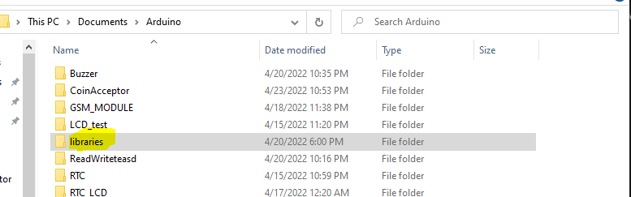
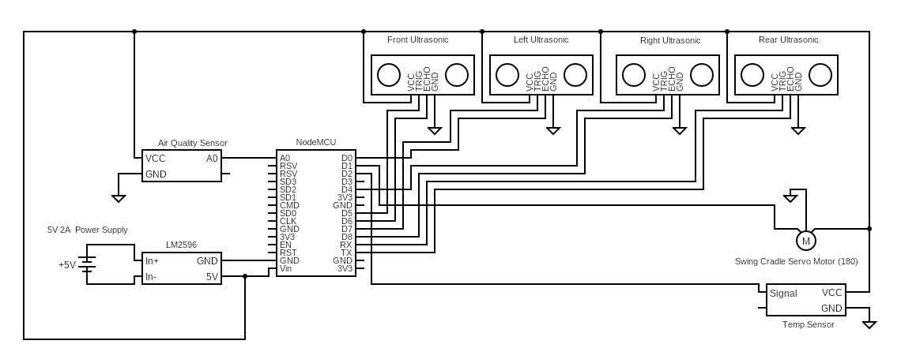

# SmartCradle

## Steps to Setup SmartCradle
1. Clone this repository 
```
git clone https://github.com/pd1drone/SmartCradle
```
2. Get the Adafruit_Unified_Sensor,AsyncTCP,ESPAsyncTCP,ESPAsyncWebSrv and DHT_sensor_library, folder and copy it to the folder libraries it is located the arduino codes has been save it will have a libraries folder. The default folder of arduino is in /Documents/Arduino/libraries/


3. Setup the Schematic Diagram Below


4. After setting up the Schematic Diagram Open the SmartCradle.ino file in arduino and then upload.

